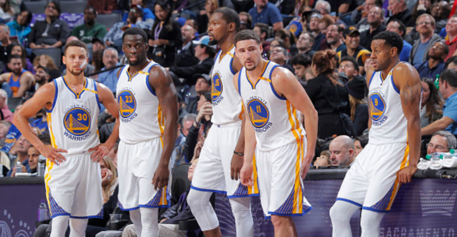
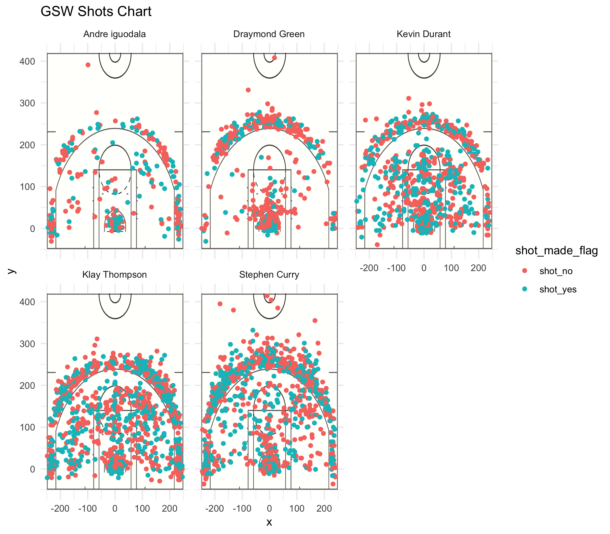

```{r setup, include=FALSE}
knitr::opts_chunk$set(echo = TRUE)
```

```{r echo=FALSE, message=FALSE}
library(kableExtra)
library(knitr)
library(plyr)
shots_data <- read.csv("../data/shots-data.csv")
```
###Introduction
The **Golden State Warriors** are an American professional basketball team based in Oakland, California. They are known are known as one of the most successful teams in the basketball. They are very famous in **National Basketball Association ** games. NBA is a men's professional basketball league in North America; composed of 30 teams. It is widely considered to be the premier men's professional basketball league in the world. Some of the most famous and talents players of Golden State Varriors are Klay Thompson, Draymond Green, Kevin Durant, Stephen Curry, and Andre Iguodala.Green has the defense position, Curry and Thompson are the three point shooters, and Durant and Iguodala are the two point shooters.

**Stephen Curry, Klay Thompson, Draymond Green, and Kevin Durant during 2017 NBA Finals**
```{r out.width="80%", echo=FALSE, fig.align='center'}

```

###Background
The history of the Golden State Warriors began in Philadelphia in 1946. It was first relocated to San Francisco, California and became known as the San Francisco Warriors until 1971, when its name was changed to the current Golden State Warriors. Along with their inaugural championship win in the 1946–47 season, the Warriors have won five others in the team's history, including another in Philadelphia after the 1955–56 season, and four more as Golden State after the 1974–75, 2014–15, 2016–17, and 2017–18 seasons. The Warriors won the inaugural Basketball Association of America (BAA) championship in 1947, and won its second championship in 1956, led by Hall of Fame trio Paul Arizin, Tom Gola, and Neil Johnston. However, the Warriors would not return to similar heights in Philadelphia, and after a brief rebuilding period following the trade of star Wilt Chamberlain, the team moved to San Francisco. With star players Jamaal Wilkes and Rick Barry, the Warriors returned to title contention, and won their third championship in 1975, in what is largely considered one of the biggest upsets in NBA history.

###Data
The data for this report is from the five raw data sets that consists of the shots taken by 5 players from the Golden State Warriors in 2016 season. The name of the players are Stephen Curry, Kevin Durant, Andre Iguodala, Klay Thompson, and Draymond Green. In their shot statistic, It has player’s attempted shots that consists of minutes and seconds, and the time remaining after the shot was taken. It also includes players’ coordinates shot, type of field goal, the success and failure of the shot.

###Analysis
This image includes the shots of all the above five players made during the 2016 season.  The dots mean the player attempted a shot, blue means a shot was successful and red means the player missed the shot. Among the five players Stephen Curry and Klay Thompson made the most shots. Stephen Curry has the point guard position which means he would defense and would try to keep the ball on the side of his team. Klay Thompson role have the shooting guard position which means he scores for the teams. Draymond Green and Kevin Durant have the power forward positions and they score from inside the three-pointer line. Andre Iguodala has the small forward position and he has made the least shots; however, he is able to shoot from an y distance. From this analysis, we can conclude that Curry, Thompson, and Durant made the most shots for the team during the 2016-2017 season. 

```{r out.width="80%", echo=FALSE, fig.align='center'}

```

###2PT Effective Shooting % by Players
This data shows that Durant and Thompson attempted the most shots. Durant threw a total of 643 shots, making 60.65% of the shots. Thompson made threw a total of 640 shots, making 51.40% of his total of the shots. Iguodala threw a total of 210 shots, making  63.81% out of shots.Curry and Thompson were in the middle, both with over 50% shot accuracy. Green had the lowest shot percentage of 49.42%.
```{r, include = FALSE}
curry <- read.csv("../data/stephen-curry.csv", stringsAsFactors = FALSE)
green <- read.csv("../data/draymond-green.csv", stringsAsFactors = FALSE)
durant <- read.csv("../data/kevin-durant.csv", stringsAsFactors = FALSE)
klay <- read.csv("../data/klay-thompson.csv", stringsAsFactors = FALSE)
iguodala <- read.csv("../data/andre-iguodala.csv", stringsAsFactors = FALSE)

durant2 <- durant[durant$shot_type== "2PT Field Goal",]
durant3 <- durant[durant$shot_type== "3PT Field Goal",]

curry2 <- curry[curry$shot_type== "2PT Field Goal",]
curry3 <- curry[curry$shot_type== "3PT Field Goal",]

green2 <- green[green$shot_type== "2PT Field Goal",]
green3 <- green[green$shot_type== "3PT Field Goal",]

klay2 <- klay[klay$shot_type== "2PT Field Goal",]
klay3 <- klay[klay$shot_type== "3PT Field Goal",]

iguodala2 <- iguodala[iguodala$shot_type== "2PT Field Goal",]
iguodala3 <- iguodala[iguodala$shot_type== "3PT Field Goal",]
```
```{r echo = FALSE, results = 'hide', message = FALSE}
Total <- c(length(iguodala2$shot_made_flag),length(green2$shot_made_flag),length(durant2$shot_made_flag),length(klay2$shot_made_flag),length(curry2$shot_made_flag))

made <- rbind(sum(iguodala2$shot_made_flag == "y"),sum(green2$shot_made_flag == "y"),sum(durant2$shot_made_flag == "y"),sum(klay2$shot_made_flag == "y"),sum(curry2$shot_made_flag == "y"))

perc_made <- c(made/Total)
Names <- c("iguodala","green", "durant", "klay", "curry")

df2 <- data.frame(Names, Total, made, perc_made)
df2 <- df2[order(-perc_made),]
```

```{r echo=FALSE}
df2
```  

###3PT Effective Shooting % by Players
This data shows that Curry had the most attempted shots then Thompson. Both players have most total shots and highest shot percentages. Thompson made 580 shot with an accuracy of 42.41%. Curry made 687 shots with an accuracy of 40.76%. Iguodala made 161 shots, he had the lowest total number of shots and Green had the lowest shot percentage of 31.89%. 
```{r echo = FALSE, results = 'hide', message = FALSE}
Total <- c(length(iguodala3$shot_made_flag),length(green3$shot_made_flag),length(durant3$shot_made_flag),length(klay3$shot_made_flag),length(curry3$shot_made_flag))

made <- rbind(sum(iguodala3$shot_made_flag == "y"),sum(green3$shot_made_flag == "y"),sum(durant3$shot_made_flag == "y"),sum(klay3$shot_made_flag == "y"),sum(curry3$shot_made_flag == "y"))

perc_made <- c(made/Total)

df3 <- data.frame(Names, Total, made, perc_made)
df3 <- df3[order(-perc_made),]
```

```{r echo=FALSE}
df3
```  

###Shot Type Total and Made % by Players
This data shows that Curry made the most three-point field goals. All other players were stuck with the two-point field goals. Thompson was the closest to Curry, nearly 50% of his total shots were made behind the three-point line.  70% of Durant’s shots were within the three-point line. He made more shots from a closer distance to the hoop. Being a power forward, Green had more shots inside the three-point line.

```{r echo = FALSE, results = 'hide', message = FALSE}
Names <- c("Andre Iguodala", "Draymond Green", "Kevin Durant" , "Klay Thompson", " Stephen Curry")

Total <- c(length(iguodala$shot_made_flag),length(green$shot_made_flag),length(durant$shot_made_flag),length(klay$shot_made_flag),length(curry$shot_made_flag))

made <- rbind(sum(iguodala$shot_made_flag == "y"),sum(green$shot_made_flag == "y"),sum(durant$shot_made_flag == "y"),sum(klay$shot_made_flag == "y"),sum(curry$shot_made_flag == "y"))

perc_made <- c(made/Total)

df1 <- data.frame(Names, Total, made, perc_made)
df1 <- df1[order(-perc_made),]
```

```{r echo=FALSE}
df1
```  

###Conclusion
Based on the data here we can conclude that these five players are incredible players and one of the best in their field and that is why The Golden State Warrior is one of the best and most successful basketball team in the NBA history. 

